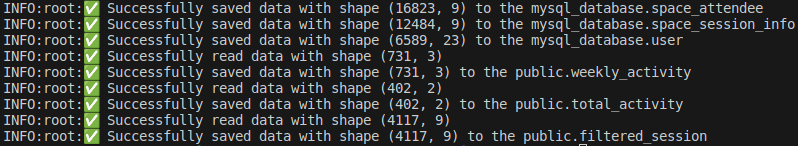
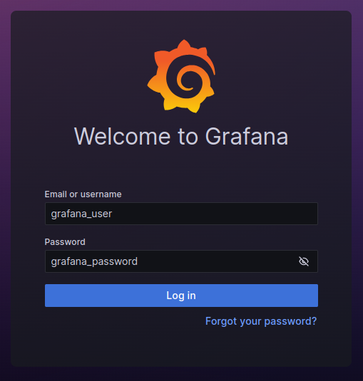
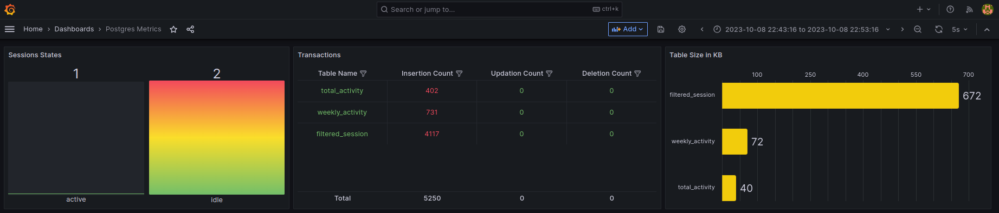

# ETL Pipeline and Dockerization Project

This project involves designing and implementing an ETL (Extract, Transform, Load) pipeline to handle various data-related operations. The pipeline includes importing CSV data into a MySQL database, calculating aggregate data and storing it in a PostgreSQL database, Dockerizing the ETL application, and using Docker Compose to deploy both MySQL and PostgreSQL databases and run the ETL code within containers. Additionally, we created optional components like Grafana for monitoring.

## Table of Contents
- [Project Overview](#project-overview)
- [Project Structure](#project-structure)
- [Getting Started](#getting-started)
- [Grafana Integration](#grafana-integration)
- [Alternative approaches and Suggestions](#alternative-approaches-and-suggestions)
- [Conclusion](#conclusion)

## Project Overview

The main objectives of this project are:
1. Import CSV data into a MySQL database.
2. Calculate aggregate data and store it in a PostgreSQL database, including weekly average activity and total activity for each email domain, while filtering out invalid sessions.
3. Containerize the ETL application using Docker.
4. Use Docker Compose to deploy MySQL and PostgreSQL databases and run the ETL code within containers.
5. Monitore some Postgres metrics using Grafana 


## Project Structure

Here's a structured overview of the project directory with descriptions for each file and directory:

- **ETL**
    - `requirements.txt`: Contains a list of Python packages required for project.
    - `requirements.dev.txt`: Contains a list of Python packages required for development.
    - `README.md`: Documentation file for project.
    - `Dockerfile`: Configuration file for building a Docker image for application.
    - `docker-compose.yml`: Configuration for Docker Compose, defining services and containers.
    - `docker_cleanup.sh`: A shell script for cleaning up Docker containers and resources.
    - `DATADESCRIPTION.md`: Documentation describing the data used in the project.
    - `.gitignore`: A file specifying which files and directories to ignore when using Git.
    - `.dockerignore`: A file specifying which files and directories to ignore when using docker.
    - `.env`: Environment file for storing configuration variables.

    - **data**: Directory for storing data files.
        - `user.csv`: CSV file containing user data.
        - `space_session_info.csv`: CSV file containing space session information.
        - `space_attendee.csv`: CSV file containing attendee data.

    - **configs**: Directory for configuration files.
        - **grafana**: Directory for Grafana-related configurations.

    - **app**: Directory containing application's source code.
        - `queries.py`: Python module for defining database queries.
        - `main.py`: Main application file.
        - `connections.py`: Python module for managing database connections.
        - `configs.py`: Configuration file for application.
        - `__init__.py`: Python package initialization file.


## Getting Started
To get started with this project, follow these steps:

1) Install git https://git-scm.com/book/en/v2/Getting-Started-Installing-Git  
2) Clone the project repository.
3) Change to the project diractory (ETL).
4) Install docker https://docs.docker.com/engine/install/
5) Install docker-compose https://docs.docker.com/compose/install/  
6) Run etl process
```bash
docker-compose up -d --build
```
7) To check the success of ETL you need to run
```bash
docker logs app_container
```



## Grafana Integration 

To see Postgres metrics in the Grafana dashboard, you need to go to  
http://localhost:3000/d/postgresmetrics or http://localhost:3000/d/postgresmetrics_v2  

 

## Alternative approaches and Suggestions

When working on your ETL project using a custom Python application, there are several alternative approaches and suggestions to consider for improving your development workflow and project management. Here are some recommendations:

### 1) Integration with Poetry Instead of `requirements.txt`

[Poetry](https://python-poetry.org/) is a modern Python packaging and dependency management tool that can simplify the management of project's dependencies. Consider using Poetry instead of a traditional `requirements.txt` file. Poetry provides a more structured and Pythonic way to define and manage dependencies, making it easier to create a reproducible environment for ETL project.

To get started with Poetry:

1. Install Poetry by following the instructions on their website.
2. Create a `pyproject.toml` file in project's root directory and define project dependencies using Poetry's `pyproject.toml` format.
3. Use Poetry commands to manage project's virtual environment, dependencies, and packaging.

By using Poetry, we can ensure a cleaner, more consistent, and more maintainable approach to managing our project's dependencies.

### 2) Integration with MyPy

[MyPy](https://mypy.readthedocs.io/en/stable/) is a static type checker for Python that can help us catch type-related errors and improve code quality. By adding type hints to our custom Python ETL application and integrating MyPy into our workflow, we can enhance code readability and reduce potential bugs.

To integrate MyPy:

1. Add type hints to our Python code using Python's type annotation syntax.
2. Install MyPy using poetry/pip.
3. Run MyPy against our codebase to check for type-related issues and enforce type checking in our development process.

MyPy can provide valuable feedback and make your ETL codebase more robust and maintainable, especially as our project grows.

### 3) Integration with Pre-commit

[Pre-commit](https://pre-commit.com/) is a tool that helps us set up and manage pre-commit hooks for code formatting, linting, and other checks. By configuring pre-commit hooks for our ETL project, we can automate code quality checks, ensuring that all code commits meet specific standards before they are accepted into our repository.

To set up pre-commit:

1. Install pre-commit using poetry/pip.
2. Create a `.pre-commit-config.yaml` file in our project's root directory to define the hooks we want to run.
3. Install and configure the hooks we specified in our configuration file.

By integrating pre-commit into our workflow, we can maintain code consistency, catch issues early, and improve collaboration among team members.

### 4) Integration with Airflow Instead of Python Scripts

As our ETL process becomes more complex, consider transitioning from custom Python scripts to a workflow orchestration tool like [Apache Airflow](https://airflow.apache.org/). Airflow provides a platform for managing, scheduling, and monitoring ETL workflows, making it easier to handle dependencies, retries, and error handling in a more robust manner.

To use Airflow:

1. Install and set up Apache Airflow following its documentation.
2. Define our ETL tasks as Airflow operators and create a directed acyclic graph (DAG) that represents our ETL workflow.
3. Schedule and monitor our ETL processes using Airflow's web interface.

Airflow offers advantages such as task parallelization, scheduling flexibility, and better visibility into our ETL pipeline's status and performance. This can significantly improve the reliability and scalability of our ETL process.

Incorporating these alternative approaches and suggestions into our ETL project can lead to better code quality, dependency management, automation, and scalability, ultimately making our ETL process more efficient and maintainable.


## Conclusion
This project successfully implements an ETL pipeline for data processing, Dockerizes the application, and uses Docker Compose to deploy databases and run the ETL code within containers. Optional components like Grafana integration added for monitoring purposes.
